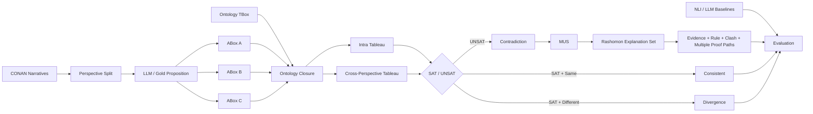

# Rashomon-Tableau

## Perspective-Aware Neuro-Symbolic Contradiction Reasoning over Multi-Perspective Detective Narratives

> **핵심 메시지:** 서로 다른 관점은 곧 모순이 아니다.  
> 관점별 논리 세계를 분리하고, Ontology + Tableau로 양립 가능성을 검증한 뒤, Rashomon 관점에서 복수의 타당한 모순 설명 경로를 보존한다.

- 논문형 상세 보고서: [`report.md`](./report.md)
- 예비 controlled 결과: [`results/preliminary_controlled_metrics.json`](./results/preliminary_controlled_metrics.json)

---

# 1. Research Poster Summary

| 항목 | 내용 |
|---|---|
| **Problem** | Pairwise NLI와 일반 그래프 탐색은 표면 문장 충돌에는 강하지만, ontology implication을 거쳐 발생하는 **implicit contradiction**과 **perspective divergence**를 명확히 구분하기 어렵다. |
| **Dataset** | CONAN detective-narrative benchmark의 인물별 관점 서사와 관계 Gold label |
| **Core Idea** | `Perspective-separated ABox + Ontology + Tableau SAT/UNSAT + MUS + Rashomon Explanation Set` |
| **RQ1** | LLM은 다중 관점 자연어 서사를 논리 명제로 얼마나 정확하게 변환하는가? |
| **RQ2** | 개별 관점 내부 모순과 관점 간 모순을 Tableau로 구분할 수 있는가? |
| **RQ3** | Pairwise NLI와 비교할 때 논리 추론 기반 방식이 implicit contradiction을 더 잘 탐지하는가? |
| **RQ4** | 모순의 논리 경로를 제공함으로써 설명가능성을 향상시킬 수 있는가? |
| **Output** | `Consistent / Divergence / Intra-Contradiction / Inter-Contradiction` + clash + MUS + multiple proof paths |

---

# 2. Motivation

다중 인물 서사에서는 동일 사건을 서로 다르게 기술할 수 있다.

```text
Perspective A: John likes Mary.
Perspective B: John works with Susan.
```

두 명제는 다르지만 동시에 참일 수 있다.

```text
A_i != A_j
SAT(T ∪ A_i ∪ A_j) = 1
→ Divergence
```

반면 Ontology를 거친 후 다음과 같은 충돌이 생길 수 있다.

```text
Perspective A:
DaughterOf(Mary, Tom)

Ontology:
DaughterOf(x,y) -> ChildOf(x,y)

Perspective B:
NOT ChildOf(Mary, Tom)
```

따라서

```text
ChildOf(Mary, Tom)
AND
NOT ChildOf(Mary, Tom)
→ CLASH
```

즉 표면적으로 동일 predicate가 직접 충돌하지 않아도 **implicit contradiction**을 탐색할 수 있다.

---

# 3. Proposed Architecture



```text
CONAN
→ Proposition
→ Perspective-specific ABoxes
→ Ontology Closure
→ Tableau SAT/UNSAT
→ Consistent / Divergence / Contradiction
→ MUS
→ Rashomon Explanation Set
→ Accuracy / F1 / Implicit Recall
```

---

# 4. Mathematical Definition

각 관점의 명제 집합을 `A_i`, 공통 Ontology를 `T`라고 한다.

```text
K_i = T ∪ A_i
```

## Intra-Perspective Contradiction

```text
C_intra(P_i) = 1 - SAT(T ∪ A_i)
```

## Inter-Perspective Contradiction

```text
SAT(T ∪ A_i) = 1
SAT(T ∪ A_j) = 1
SAT(T ∪ A_i ∪ A_j) = 0
→ C_inter(P_i,P_j) = 1
```

## Divergence

```text
A_i != A_j
SAT(T ∪ A_i ∪ A_j) = 1
→ Divergence
```

## Implicit Contradiction

```text
T ∪ A_i |= phi
T ∪ A_j |= NOT phi
→ C_implicit(P_i,P_j) = 1
```

---

# 5. Rashomon Explanation

하나의 모순을 설명하는 가능한 경로를

```text
Pi(c) = {pi_1, pi_2, ..., pi_k}
```

라고 할 때, 하나의 best path만 반환하지 않고 거의 동등한 설명을 보존한다.

```text
R_epsilon(c)
= { pi | pi proves c, Score(pi) >= Score(pi*) - epsilon }
```

또한 전체 UNSAT 집합에서 실제 충돌을 만드는 최소 명제 집합을 추출한다.

```text
MUS_ij
= min { M subset A_i ∪ A_j | SAT(T ∪ M) = 0 }
```

최종 설명 구조:

```text
Original Evidence
      ↓
Proposition
      ↓
Ontology Rule
      ↓
Derived Proposition
      ↓
Conflicting Proposition
      ↓
CLASH
      ↓
MUS / Alternative Proof Paths
```

---

# 6. Difference from ToG / Graph Reasoning

| 구분 | ToG / Graph Search | GNN | Rashomon-Tableau |
|---|---|---|---|
| 목적 | 정답 경로 탐색 | label / score 예측 | **관점의 논리적 양립 가능성 판정** |
| 핵심 연산 | Beam / Path Search | Message Passing | **SAT / UNSAT + Clash** |
| 경로 의미 | Answer-supporting path | Feature propagation | **Logical proof path** |
| 관점 분리 | 일반적으로 없음 | 일반적으로 없음 | **Perspective-specific ABox** |
| implicit contradiction | 직접 목적 아님 | 학습 의존 | **Ontology inference** |
| 결과 | Answer | Probability | **Consistent / Divergence / Contradiction** |
| 설명 | 선택 경로 | 제한적 | **MUS + multiple logical proofs** |

```text
ToG:
Which graph path supports the answer?

Rashomon-Tableau:
Can these perspectives logically coexist?
If not, which minimal proof paths establish the contradiction?
```

---

# 7. CONAN Dataset

본 PoC는 CONAN의 인물별 관점 서사와 관계 Gold label을 사용한다.

```text
data/<language>/
├─ data_final/<story>/txt/<character>.txt
└─ label/<story>/<character>.json
```

예:

```text
"Jue Ming"
    -> ["Feng", "Messenger of X"]

→ MessengerOf(Jue_Ming, Feng)
```

CONAN 원본 데이터는 본 저장소에 재배포하지 않고 다운로드 스크립트만 제공한다.

---

# 8. Experimental Design

## RQ1 — Natural Language → Proposition

```text
Narrative
→ LLM Proposition Extraction
→ (subject, relation, object)
→ CONAN Gold Triple 비교
```

- Micro Precision
- Micro Recall
- Micro F1

## RQ2 — Perspective Contradiction

```text
Tableau(T ∪ A_i)
Tableau(T ∪ A_j)
Tableau(T ∪ A_i ∪ A_j)
```

- Consistent
- Divergence
- Intra-Contradiction
- Inter-Contradiction

## RQ3 — Implicit Contradiction

- Explicit contradiction
- Hierarchy-based implicit contradiction
- Inverse-based implicit contradiction

## RQ4 — Explainability

- Proof validity
- Evidence faithfulness
- Path completeness
- MUS minimality
- Alternative explanation coverage

---

# 9. Preliminary Controlled Results

2026-08-24 기준으로 현재 구현의 reasoner correctness를 확인하기 위해 CONAN Gold relation을 이용한 controlled verification을 수행했다.

### Evaluation setup

- CONAN story: `655-The Mysterious Case of Zhangdong Town (6 people)`
- Perspectives sampled for verification: `Xiting`, `Yang Minxi`
- Random seed: `42`
- Cases: `80`

| Subtype | Cases | Accuracy |
|---|---:|---:|
| Explicit contradiction | 20 | **1.000** |
| Hierarchy implicit contradiction | 10 | **1.000** |
| Inverse implicit contradiction | 10 | **1.000** |
| Same-fact consistent | 20 | **1.000** |
| Non-conflicting divergence | 20 | **1.000** |

### Aggregate

| Metric | Rashomon-Tableau |
|---|---:|
| Accuracy | **1.000** |
| Macro-F1 | **1.000** |
| Implicit Contradiction Recall | **1.000** |
| Total Cases | **80** |

> **중요:** 위 1.000은 자연 서사의 일반화 성능이 아니다. CONAN Gold proposition에서 Ontology 규칙을 이용해 controlled case를 구성하고 같은 의미론으로 reasoner를 검증한 **correctness test**이다. 논문에서 자연 모순 탐지 성능을 주장하려면 human-annotated perspective benchmark에서 baseline과 비교해야 한다.

---

# 10. Poster Result Table

`N/E`는 **Not Executed**를 의미한다. 측정하지 않은 baseline 값은 임의로 생성하지 않는다.

| Method | Accuracy | Macro-F1 | Implicit Recall | Explanation | Status |
|---|---:|---:|---:|---|---|
| Pairwise NLI | N/E | N/E | N/E | No logical proof | Natural benchmark 실행 필요 |
| LLM Direct Judge | N/E | N/E | N/E | Natural-language rationale | Natural benchmark 실행 필요 |
| Vanilla Tableau | N/E | N/E | N/E | Single logical clash | Ablation 실행 필요 |
| Perspective Tableau | N/E | N/E | N/E | Perspective-aware clash | Ablation 실행 필요 |
| **Rashomon-Tableau** | **1.000*** | **1.000*** | **1.000*** | **MUS + Multiple proof paths** | Controlled verification 완료 |

`*` Controlled reasoner-verification score. Natural human-annotated benchmark score가 아님.

---

# 11. Baselines and Ablation

```text
B1. Pairwise NLI
B2. LLM Direct Contradiction Judge
B3. Ontology Rule Only
B4. Vanilla Merged-ABox Tableau
B5. Perspective-separated Tableau
B6. Rashomon-Tableau (Proposed)
```

핵심 ablation:

```text
Tableau
   vs
Tableau + Perspective Separation
   vs
Tableau + Perspective Separation + Rashomon
```

---

# 12. Expected Contributions

1. **Perspective-aware contradiction definition**  
   `Divergence != Contradiction`을 논리적으로 구분한다.

2. **Ontology-mediated implicit contradiction**  
   표면 predicate가 직접 충돌하지 않아도 implication을 통해 모순을 찾는다.

3. **Tableau-based verifiable reasoning**  
   확률 점수뿐 아니라 `SAT/UNSAT`, clash, 적용 rule을 반환한다.

4. **Rashomon explanation set**  
   하나의 설명을 강제하지 않고 복수의 타당한 논리 경로를 보존한다.

5. **Reproducible CONAN evaluation pipeline**  
   명제 추출과 symbolic reasoning의 성능을 분리해 평가한다.

---

# 13. Repository Structure

```text
ontolgoy-Rashomon-Tableau/
├─ config/
│  └─ ontology_rules.yaml
├─ scripts/
│  ├─ download_conan.py
│  └─ build_annotation_set.py
├─ src/rashomon_tableau/
│  ├─ conan_loader.py
│  ├─ ontology.py
│  ├─ tableau.py
│  ├─ rashomon.py
│  ├─ benchmark.py
│  ├─ evaluation.py
│  ├─ llm_extractor.py
│  └─ nli_baseline.py
├─ results/
│  └─ preliminary_controlled_metrics.json
├─ tests/
├─ run_experiment.py
├─ report.md
└─ README.md
```

---

# 14. Run

```bash
git clone https://github.com/dooyoung94/ontolgoy-Rashomon-Tableau.git
cd ontolgoy-Rashomon-Tableau
python -m venv .venv
```

Windows:

```bash
.venv\Scripts\activate
pip install -e .
python scripts/download_conan.py
python run_experiment.py --mode gold --benchmark controlled --max-stories 3
```

Outputs:

```text
results/
├─ relation_inventory.json
├─ predictions.csv
├─ predictions.json
└─ metrics.json
```

---

# 15. RQ1 LLM Mode

```bash
pip install -r requirements-llm.txt
```

```text
OPENAI_API_KEY=<your-key>
```

```bash
python run_experiment.py --mode llm --benchmark controlled --max-stories 1 --llm-model gpt-5-mini
```

결과:

```text
results/rq1_llm_extraction.json
```

---

# 16. Build Human Annotation Benchmark

```bash
python scripts/build_annotation_set.py --max-stories 3 --max-pairs-per-story 100
```

`data/annotations/contradiction_candidates.csv`의 `label`을 다음 중 하나로 작성한다.

```text
consistent
divergence
contradiction
```

실행:

```bash
python run_experiment.py --benchmark annotated --annotation-file data/annotations/contradiction_candidates.csv
```

---

# 17. One-Minute Poster Script

> 기존 NLI는 문장 pair의 contradiction 판별에는 강하지만, 다중 관점에서 단순한 정보 차이와 실제 논리적 모순을 구분하기 어렵습니다. 본 연구는 CONAN의 각 인물 관점을 독립적인 ABox로 유지하고, Ontology로 관계 의미를 확장한 뒤 Tableau로 각 관점 및 관점 결합의 satisfiability를 검사합니다. 각각의 관점은 일관적이지만 결합했을 때만 unsatisfiable한 경우를 inter-perspective contradiction으로 정의합니다. 또한 하나의 모순 설명만 선택하지 않고 MUS를 기반으로 복수의 동등하게 타당한 proof path를 Rashomon explanation set으로 유지합니다. 현재 controlled 80-case reasoner verification에서는 Accuracy와 Macro-F1, implicit contradiction recall이 모두 1.000으로 확인되었으며, 다음 단계에서는 human-annotated CONAN perspective benchmark에서 Pairwise NLI와 Vanilla Tableau를 비교합니다.

---

# 18. Take-Home Message

```text
Different perspectives are not necessarily contradictions.

Difference
   ↓
Divergence
   vs
Logical Incompatibility
   ↓
Contradiction
```

---

# References

- Zhao et al., **Large Language Models Fall Short: Understanding Complex Relationships in Detective Narratives**, Findings of ACL 2024.
- Zhao et al., **SymbolicThought: Integrating Language Models and Symbolic Reasoning for Consistent and Interpretable Human Relationship Understanding**, ACL 2026 Demo.
- **It Takes Two to Tango: The Rashomon Effect in Machine Translation**, NLPerspectives 2026.
- CONAN Dataset: https://github.com/BLPXSPG/Conan
- Sun et al., **Think-on-Graph: Deep and Responsible Reasoning of Large Language Model on Knowledge Graph**, ICLR 2024.

## Research Positioning

**Perspective-Aware Neuro-Symbolic Contradiction Reasoning**  
**Ontology + Tableau + Rashomon Explanations over Multi-Perspective Narratives**
