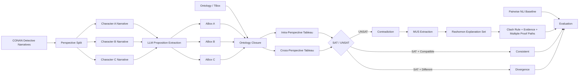

# Rashomon-Tableau

## Perspective-Aware Logical Contradiction Detection over CONAN Detective Narratives

> **핵심 질문:** 서로 다른 인물의 서사가 다르다는 이유만으로 모순이라고 판단하면 안 된다.  
> **제안:** 관점별 논리 세계를 분리하고, Ontology + Tableau로 양립 가능성을 검증한 뒤, Rashomon 관점에서 복수의 타당한 모순 설명 경로를 보존한다.

---

## 1. Research Poster Summary

| 항목 | 내용 |
|---|---|
| **Problem** | Pairwise NLI와 일반 그래프 탐색은 표면 문장 간 충돌에는 강하지만, ontology implication을 거쳐 발생하는 **implicit contradiction**과 **관점 차이(divergence)**를 명확히 구분하기 어렵다. |
| **Dataset** | CONAN detective-narrative benchmark의 인물별 관점 서사와 관계 라벨 |
| **Core Idea** | `Perspective-separated ABox + Ontology + Tableau SAT/UNSAT + Rashomon Explanation Set` |
| **RQ1** | LLM은 다중 관점 자연어 서사를 논리 명제로 얼마나 정확하게 변환하는가? |
| **RQ2** | 개별 관점 내부 모순과 관점 간 모순을 Tableau로 구분할 수 있는가? |
| **RQ3** | Pairwise NLI와 비교할 때 논리 추론 기반 방식이 implicit contradiction을 더 잘 탐지하는가? |
| **RQ4** | 모순의 논리 경로를 제공함으로써 설명가능성을 향상시킬 수 있는가? |
| **Output** | `Consistent / Divergence / Intra-Contradiction / Inter-Contradiction` + clash path + MUS + Rashomon explanations |

---

# 2. Motivation

다중 인물 서사에서는 동일 사건에 대해 서로 다른 관점이 동시에 존재한다.

예를 들어 다음 두 관점은 서로 다르지만 반드시 모순은 아니다.

```text
Perspective A: John likes Mary.
Perspective B: John works with Susan.
```

두 명제는 동시에 참일 수 있다.

```text
A_i != A_j
SAT(T ∪ A_i ∪ A_j) = 1
→ Perspective Divergence
```

반면 다음 경우는 ontology 추론 후 논리적 충돌이 발생한다.

```text
Perspective A:
DaughterOf(Mary, Tom)

Ontology:
DaughterOf(x,y) -> ChildOf(x,y)

Perspective B:
NOT ChildOf(Mary, Tom)
```

따라서

```text
ChildOf(Mary, Tom)
AND
NOT ChildOf(Mary, Tom)
→ CLASH
```

표면 문장에 동일한 predicate가 직접 등장하지 않더라도 **implicit contradiction**을 탐색할 수 있다.

---

# 3. Proposed Research Hypothesis

본 연구의 핵심 가설은 다음과 같다.

> **다중 관점을 하나의 그래프로 즉시 합치지 않고 관점별 논리 세계로 유지한 뒤, Ontology 기반 의미 확장과 Tableau satisfiability 검사를 수행하면, 단순 관점 차이와 실제 논리 모순을 구분하면서 implicit contradiction과 설명 경로를 함께 탐색할 수 있다.**

이를 위해 일반적인 `best-path search`가 아니라 다음 세 가지를 분리한다.

1. **Perspective World Construction**
2. **Logical Compatibility Test**
3. **Rashomon Explanation Preservation**

---

# 4. Overall Architecture



### 전체 처리 흐름

```text
Natural Language Narratives
        ↓
Perspective Separation
        ↓
LLM Logical Symbolization
        ↓
(subject, relation, object, polarity)
        ↓
Perspective-specific ABoxes
        ↓
Ontology Closure
        ↓
Tableau SAT / UNSAT
        ↓
Consistent / Divergence / Contradiction
        ↓
Minimal Unsatisfiable Subset
        ↓
Rashomon Explanation Set
        ↓
Accuracy / F1 / Implicit Recall / Explanation Evaluation
```

---

# 5. What is Different from ToG / General Graph Reasoning?

본 연구의 목적은 **답을 찾기 위한 최적 그래프 경로 탐색**이 아니다.

| 구분 | ToG / Graph Search | GNN | Proposed Rashomon-Tableau |
|---|---|---|---|
| 핵심 목적 | 정답으로 연결되는 path 탐색 | label / score 예측 | **여러 관점의 논리적 양립 가능성 판정** |
| 핵심 연산 | Beam / Path Search | Message Passing | **SAT / UNSAT + Clash** |
| 그래프 경로 의미 | Answer-supporting path | Feature propagation | **Logical proof / contradiction path** |
| 관점 분리 | 일반적으로 없음 | 일반적으로 없음 | **Perspective-specific ABox** |
| implicit contradiction | 직접 목적 아님 | 학습 의존 | **Ontology inference로 탐색** |
| 결과 | Answer | Probability | **Consistent / Divergence / Contradiction** |
| 설명 | 선택된 경로 | 제한적 | **MUS + Clash + Rashomon explanations** |

### 핵심 차이

```text
ToG:
Which graph path supports the answer?

Rashomon-Tableau:
Can these perspectives logically coexist?
If not, which minimal logical paths prove the contradiction?
```

---

# 6. Mathematical Formulation

## 6.1 Perspective-specific Knowledge Base

관점 집합을 다음과 같이 정의한다.

```text
P = {P1, P2, ..., Pm}
```

각 관점 `P_i`에서 추출한 명제 집합은

```text
A_i = {phi_i1, phi_i2, ..., phi_in}
```

공통 Ontology / TBox를 `T`라고 하면

```text
K_i = T ∪ A_i
```

이다.

---

## 6.2 Intra-Perspective Contradiction

```text
C_intra(P_i) = 1 - SAT(T ∪ A_i)
```

즉

```text
SAT(T ∪ A_i) = 0
```

이면 한 관점 내부에서 이미 모순이 발생한다.

---

## 6.3 Inter-Perspective Contradiction

각 관점은 독립적으로 일관적이지만 합쳤을 때만 모순이라면

```text
SAT(T ∪ A_i) = 1
SAT(T ∪ A_j) = 1
SAT(T ∪ A_i ∪ A_j) = 0
```

이므로

```text
C_inter(P_i, P_j) = 1
```

로 정의한다.

이는 본 연구에서 **Rashomon-type perspective contradiction**의 핵심 조건이다.

---

## 6.4 Divergence is not Contradiction

```text
A_i != A_j
```

이더라도

```text
SAT(T ∪ A_i ∪ A_j) = 1
```

이면 두 관점은 서로 다른 정보를 제공할 뿐이다.

```text
→ Divergence
```

따라서 본 연구는 단순 binary contradiction이 아니라 다음을 구분한다.

```text
1. Consistent
2. Perspective Divergence
3. Intra-Perspective Contradiction
4. Inter-Perspective Contradiction
```

---

## 6.5 Implicit Contradiction

직접적인 `phi`와 `NOT phi`가 존재하지 않아도

```text
T ∪ A_i |= phi
T ∪ A_j |= NOT phi
```

이면

```text
C_implicit(P_i, P_j) = 1
```

이다.

이 조건이 **RQ3에서 Pairwise NLI와 가장 직접적으로 비교되는 부분**이다.

---

# 7. Rashomon Explanation Set

Tableau에서 모순이 발생했을 때 하나의 설명 경로만 선택하지 않는다.

모순 `c`를 설명하는 경로 집합을

```text
Pi(c) = {pi_1, pi_2, ..., pi_k}
```

라고 한다.

최적 설명과 거의 동등한 설명들을 다음과 같이 보존한다.

```text
R_epsilon(c)
=
{
  pi |
  pi proves c,
  Score(pi) >= Score(pi*) - epsilon
}
```

즉

```text
Best Explanation 하나만 반환
                X

Multiple Near-Equivalent Explanations 유지
                O
```

한다.

### Example

```text
Explanation Path 1
A -> B -> C -> NOT C

Explanation Path 2
A -> D -> E -> NOT E
```

두 경로가 모두 동일한 contradiction을 논리적으로 설명할 수 있다면 Rashomon set에 함께 보존한다.

---

# 8. Explanation through Minimal Unsatisfiable Subset

전체 명제 집합이 UNSAT이라면 실제 모순을 발생시킨 최소 명제 집합을 찾는다.

```text
MUS_ij
=
min {
    M subset A_i ∪ A_j
    |
    SAT(T ∪ M) = 0
}
```

최종 설명은 다음 요소를 포함한다.

```text
Original Evidence
      ↓
Extracted Proposition
      ↓
Ontology Rule
      ↓
Derived Proposition
      ↓
Conflicting Proposition
      ↓
CLASH
```

예:

```text
Evidence A
"Mary is Tom's daughter."
        ↓
DaughterOf(Mary, Tom)
        ↓ hierarchy rule
ChildOf(Mary, Tom)
        ×
NOT ChildOf(Mary, Tom)
        ↑
Evidence B
```

---

# 9. CONAN Dataset Usage

본 PoC는 CONAN의 **인물별 관점 서사 + 관계 Gold Label**을 사용한다.

기본 구조:

```text
data/<language>/
├─ data_final/
│  └─ <story>/
│     └─ txt/
│        ├─ <character_A>.txt
│        ├─ <character_B>.txt
│        └─ ...
└─ label/
   └─ <story>/
      ├─ <character_A>.json
      ├─ <character_B>.json
      ├─ ...
      └─ all.json
```

Gold relation은 다음 구조를 논리 명제로 변환한다.

```text
Subject
  -> [Object, Relation]

↓

Relation(Subject, Object)
```

예:

```text
"Jue Ming"
    -> ["Feng", "Messenger of X"]

↓

MessengerOf(Jue_Ming, Feng)
```

> CONAN 원본 데이터는 본 저장소에 재배포하지 않으며 다운로드 스크립트를 제공한다.

---

# 10. Experimental Design

## Experiment A — RQ1: Natural Language → Logical Proposition

```text
CONAN Character Narrative
        ↓
LLM Proposition Extraction
        ↓
(subject, relation, object)
        ↓
Compare with CONAN Gold Relation
```

### Metrics

- Micro Precision
- Micro Recall
- Micro F1
- Entity Match
- Relation Match
- Full Triple Match

---

## Experiment B — RQ2: Intra vs Inter Contradiction

각 관점을 독립적으로 검사한 후 합집합을 검사한다.

```text
Tableau(T ∪ A_i)
Tableau(T ∪ A_j)
Tableau(T ∪ A_i ∪ A_j)
```

평가 클래스:

```text
consistent
divergence
intra_contradiction
inter_contradiction
```

---

## Experiment C — RQ3: Implicit Contradiction

다음 세 가지를 별도 subset으로 평가한다.

```text
Explicit Contradiction
Hierarchy-based Implicit Contradiction
Inverse-based Implicit Contradiction
```

### Comparison

| Method | Explicit | Implicit | Perspective-aware | Logical Proof |
|---|---:|---:|---:|---:|
| Pairwise NLI | O | △ | X | X |
| LLM Direct Judge | O | △ | △ | △ |
| Ontology Rule Only | O | O | X | O |
| Vanilla Tableau | O | O | X | O |
| **Rashomon-Tableau** | **O** | **O** | **O** | **O** |

---

## Experiment D — RQ4: Explainability

설명의 품질은 단순 자연어 설득력이 아니라 다음을 중심으로 평가한다.

- Proof Validity
- Evidence Faithfulness
- Path Completeness
- Minimality of Evidence
- Number of Valid Alternative Explanations
- Human Evaluation

---

# 11. Benchmark Strategy

## Controlled Benchmark

CONAN의 실제 Gold proposition을 사용하여 재현 가능한 논리 케이스를 생성한다.

```text
explicit contradiction
inverse-based implicit contradiction
hierarchy-based implicit contradiction
consistent
divergence
```

### 목적

- Tableau 구현 검증
- Ontology rule 검증
- MUS 추출 검증
- Rashomon explanation 생성 검증

> **주의:** Controlled benchmark의 높은 정확도는 자연 모순 탐지 성능으로 주장하지 않는다. 동일 논리 규칙을 이용해 생성된 문제이므로 reasoner correctness 검증용이다.

---

## Annotated Natural Benchmark

실제 CONAN의 서로 다른 character perspective pair를 생성한 후 사람이 다음 라벨을 부여한다.

```text
consistent

divergence

contradiction
```

이 데이터가 실제 논문 성능 비교의 핵심 benchmark가 된다.

---

# 12. Baselines

논문 실험에서는 다음 baseline을 권장한다.

```text
B1. Pairwise NLI
B2. LLM Direct Contradiction Judge
B3. Ontology Rule Only
B4. Vanilla Merged-ABox Tableau
B5. Perspective-separated Tableau
B6. Rashomon-Tableau (Proposed)
```

### 핵심 Ablation

```text
Tableau
   vs
Tableau + Perspective Separation
   vs
Tableau + Perspective Separation + Rashomon
```

이를 통해 각각 다음 효과를 분리할 수 있다.

- Ontology / Tableau 효과
- Perspective Separation 효과
- Rashomon Explanation 효과

---

# 13. Evaluation Metrics

## Classification

- Accuracy
- Precision
- Recall
- Macro-F1
- Per-class F1

## Implicit Contradiction

- Implicit Contradiction Recall
- Hierarchy Contradiction Recall
- Inverse Contradiction Recall

## Proposition Extraction

- Triple Precision
- Triple Recall
- Triple F1

## Explainability

- MUS validity
- Explanation faithfulness
- Rule-path correctness
- Alternative explanation coverage

---

# 14. Poster Result Table

실험 실행 후 `results/metrics.json`의 값을 아래 표에 채우는 것을 권장한다.

> 현재 README에는 검증되지 않은 성능 수치를 임의로 기입하지 않는다.

| Method | Accuracy | Macro-F1 | Implicit Recall | Explanation |
|---|---:|---:|---:|---|
| Pairwise NLI | TBD | TBD | TBD | No logical proof |
| LLM Direct Judge | TBD | TBD | TBD | Natural-language rationale |
| Vanilla Tableau | TBD | TBD | TBD | Single logical clash |
| Perspective Tableau | TBD | TBD | TBD | Perspective-aware clash |
| **Rashomon-Tableau** | **TBD** | **TBD** | **TBD** | **MUS + Multiple proof paths** |

---

# 15. Expected Contributions

### C1. Perspective-Aware Contradiction Definition

서로 다른 관점이라는 이유만으로 모순으로 처리하지 않고

```text
Divergence != Contradiction
```

을 논리적으로 분리한다.

### C2. Ontology-mediated Implicit Contradiction

표면 문장에서 직접 충돌하지 않더라도 ontology implication을 통해 모순을 탐색한다.

### C3. Tableau-based Verifiable Reasoning

확률적 contradiction score만 반환하는 대신

```text
SAT / UNSAT
Clash
Proof Rule
```

을 반환한다.

### C4. Rashomon Explanation Set

하나의 설명을 강제 선택하지 않고 거의 동등하게 타당한 복수의 논리 설명 경로를 보존한다.

### C5. Reproducible CONAN Evaluation Pipeline

CONAN Gold relation을 이용해 명제화 정확도와 논리 reasoner를 분리 평가한다.

---

# 16. Repository Structure

```text
ontolgoy-Rashomon-Tableau/
├─ config/
│  └─ ontology_rules.yaml
│
├─ scripts/
│  ├─ download_conan.py
│  └─ build_annotation_set.py
│
├─ src/
│  └─ rashomon_tableau/
│     ├─ conan_loader.py
│     ├─ ontology.py
│     ├─ tableau.py
│     ├─ rashomon.py
│     ├─ benchmark.py
│     ├─ metrics.py
│     ├─ llm_extractor.py
│     └─ nli_baseline.py
│
├─ tests/
│
├─ run_experiment.py
├─ requirements.txt
├─ requirements-llm.txt
├─ requirements-nli.txt
└─ README.md
```

---

# 17. Installation

```bash
git clone https://github.com/dooyoung94/ontolgoy-Rashomon-Tableau.git
cd ontolgoy-Rashomon-Tableau

python -m venv .venv
```

Windows:

```bash
.venv\Scripts\activate
```

Linux / macOS:

```bash
source .venv/bin/activate
```

설치:

```bash
pip install -e .
```

---

# 18. Download CONAN

```bash
python scripts/download_conan.py
```

---

# 19. Run GOLD / Tableau Experiment

API 없이 reasoner만 검증하려면:

```bash
python run_experiment.py \
  --mode gold \
  --benchmark controlled \
  --max-stories 3
```

Windows PowerShell에서는 한 줄로 실행해도 된다.

```bash
python run_experiment.py --mode gold --benchmark controlled --max-stories 3
```

### Outputs

```text
results/
├─ relation_inventory.json
├─ predictions.csv
├─ predictions.json
└─ metrics.json
```

- `relation_inventory.json`: CONAN relation predicate 빈도
- `predictions.csv`: case별 Gold / Prediction
- `predictions.json`: clash / ontology rule / MUS / Rashomon explanation
- `metrics.json`: Accuracy / Macro-F1 / subtype metrics

---

# 20. RQ1 — LLM Proposition Extraction

```bash
pip install -r requirements-llm.txt
```

환경 변수:

```text
OPENAI_API_KEY=<your-key>
```

실행:

```bash
python run_experiment.py \
  --mode llm \
  --benchmark controlled \
  --max-stories 1 \
  --llm-model gpt-5-mini
```

결과:

```text
results/rq1_llm_extraction.json
```

CONAN Gold triple 대비 micro Precision / Recall / F1을 계산한다.

---

# 21. Build Natural Contradiction Annotation Set

```bash
python scripts/build_annotation_set.py \
  --max-stories 3 \
  --max-pairs-per-story 100
```

생성 파일:

```text
data/annotations/contradiction_candidates.csv
```

`label`은 다음 중 하나로 작성한다.

```text
consistent

divergence

contradiction
```

실제 평가:

```bash
python run_experiment.py \
  --benchmark annotated \
  --annotation-file data/annotations/contradiction_candidates.csv
```

---

# 22. Ontology Rules

Ontology 규칙은 다음 파일에서 수정한다.

```text
config/ontology_rules.yaml
```

지원 규칙:

```text
symmetric
inverse
hierarchy
incompatible
exclusive
```

권장 절차:

```text
CONAN Gold Labels
      ↓
relation_inventory.json
      ↓
Predicate Normalization
      ↓
Ontology Rule Definition
      ↓
Reasoner Experiment
```

---

# 23. Current Tableau Scope

현재 구현은 CONAN의 binary relation 실험을 위한 **lightweight relational Tableau**이다.

현재 지원:

- positive / negative literal clash
- inverse relation closure
- hierarchy closure
- symmetry closure
- incompatible relation clash
- exclusive / functional relation violation
- intra-perspective SAT 검사
- cross-perspective SAT 검사
- bounded MUS enumeration
- Rashomon explanation set

현재 구현은 전체 OWL-DL reasoner가 아니다.

향후 다음과 같은 reasoner와 교체/비교 가능하다.

```text
OWLReady2
HermiT
Pellet
FaCT++
```

---

# 24. Test

```bash
pip install pytest
pytest -q
```

테스트 대상:

- Explicit clash
- Hierarchy implicit clash
- Inverse implicit clash
- Consistent pair
- Divergence pair

---

# 25. One-Minute Poster Presentation Script

### Problem

> 기존 NLI는 문장 pair 수준의 contradiction 판별에는 강하지만, 서로 다른 인물의 관점이 단순히 다른 것인지 실제로 논리적으로 양립할 수 없는 것인지 구분하기 어렵습니다.

### Method

> 본 연구는 CONAN의 인물별 서사를 각각 독립적인 ABox로 유지합니다. LLM이 자연어를 관계 명제로 변환하고, 공통 Ontology로 의미를 확장한 후 Tableau로 각 관점과 관점 간 결합의 SAT/UNSAT를 검사합니다.

### Novelty

> 핵심은 관점 차이를 바로 모순으로 처리하지 않는 것입니다. 각각은 satisfiable하지만 두 관점을 합쳤을 때만 unsatisfiable한 경우를 inter-perspective contradiction으로 정의합니다.

### Rashomon

> 또한 하나의 모순에 대해 하나의 설명 경로만 선택하지 않고, MUS를 기반으로 거의 동등하게 타당한 여러 논리 증명 경로를 Rashomon explanation set으로 유지합니다.

### Evaluation

> Pairwise NLI, LLM direct judge, Vanilla Tableau와 비교하여 Accuracy와 Macro-F1뿐 아니라 implicit contradiction recall과 explanation faithfulness를 평가합니다.

---

# 26. Take-Home Message

```text
Different perspectives are not necessarily contradictions.
```

본 연구가 구분하고자 하는 것은

```text
Difference
    ↓
Divergence
    vs
Logical Incompatibility
    ↓
Contradiction
```

이다.

최종적으로 제안 방법은 다음 한 줄로 요약할 수 있다.

```text
CONAN
→ LLM Proposition
→ Perspective-specific ABoxes
→ Ontology
→ Tableau SAT/UNSAT
→ Divergence / Contradiction
→ MUS
→ Rashomon Explanation Set
```

---

# References

- Zhao et al., **Large Language Models Fall Short: Understanding Complex Relationships in Detective Narratives**, Findings of ACL 2024.
- Zhao et al., **SymbolicThought: Integrating Language Models and Symbolic Reasoning for Consistent and Interpretable Human Relationship Understanding**, ACL 2026 Demo.
- CONAN Dataset / Official Repository: https://github.com/BLPXSPG/Conan
- ToG: **Think-on-Graph: Deep and Responsible Reasoning of Large Language Model on Knowledge Graph**.

---

## Research Positioning

**Perspective-Aware Neuro-Symbolic Contradiction Reasoning**  
**Ontology + Tableau + Rashomon Explanations over Multi-Perspective Narratives**
